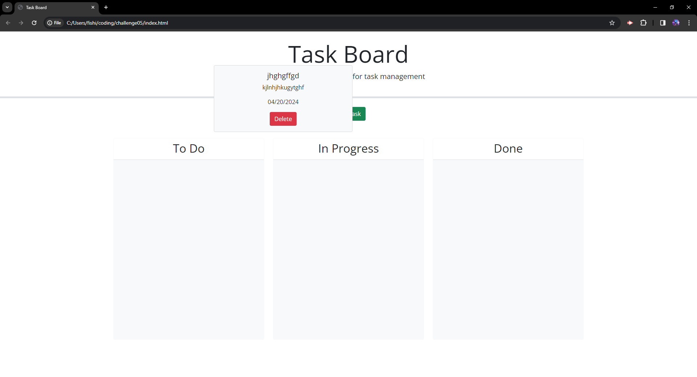

# <TJsTaskBoard>

## Description

This is a task board where you can put in a task, when it's due and a description. you can then drag the task from to do to in progress to complete. It is used to keep track of what you need to do and how far along you are in doing it.

## Installation

N/A

## Usage

Click the add task button to bring up a modal, in this modal you will enter the task name the date and a description of it. Once you have enetered those you will see a task card with the info on it show up in the to do category. the card has a delete button you can click if you need to delete it at any time. clicking and holding on the card will allow you to drag the card to the other categories depending on the progress state of it.

## Credits

N/A

## License

please refer to the license in the repo.

---
